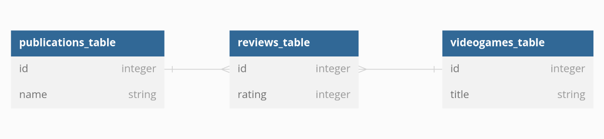

# Flask SQLAlchemy Relationships

## Learning goals:

- Create a one to many relationship using `db.relationship` and `db.ForeignKey`

- Create a many to many relationship using `association_proxy`

- Seeding with relationships

- Using the `SerializerMixin` to create json serializable information

## Getting Started

Fork / clone the repository and run `pipenv install` followed by `pipenv shell`. From there `cd server`.

To test your code you can use `flask shell` or use the prebuilt routes with Postman.

## Exercises

There are models for VideoGame, Publication, and Review. The starter code is commented out in the second half of the `models.py` file.

1. Comment in the models and create the appropriate foreign keys

2. Migrate and upgrade

3. Create a `db.relationship` between the appropriate models

4. Create an `association_proxy` between the appropriate models

5. Comment in the VideoGame and Publication area for `seed.py`, populate the Review section, and then successfully run the file

6. Add `serialize_rules` for each of the models, 

7. You can test that everything is working with `python app.py` and testing in Postman

The association is as follows:

